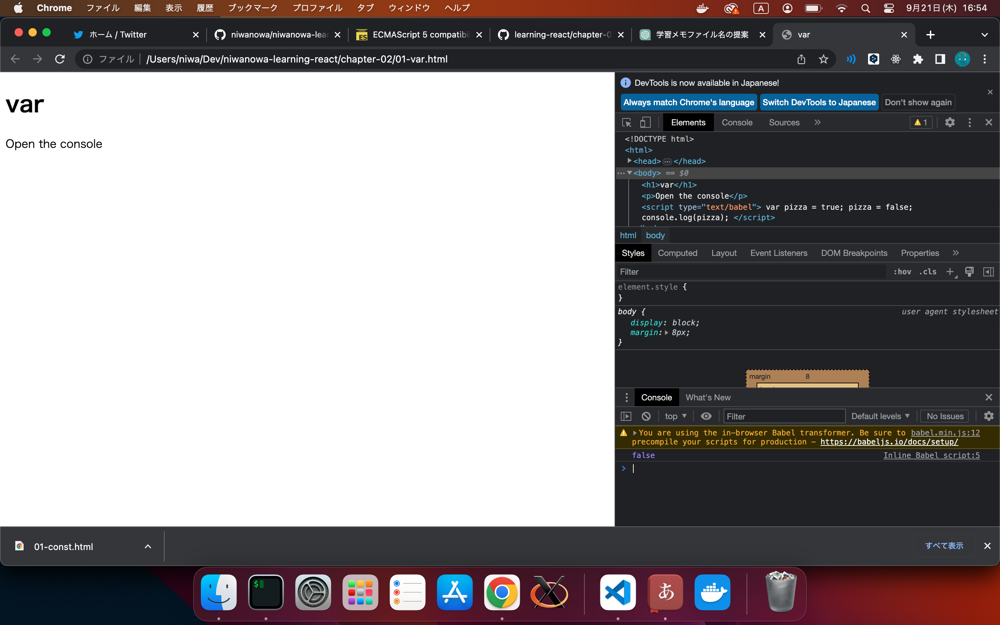
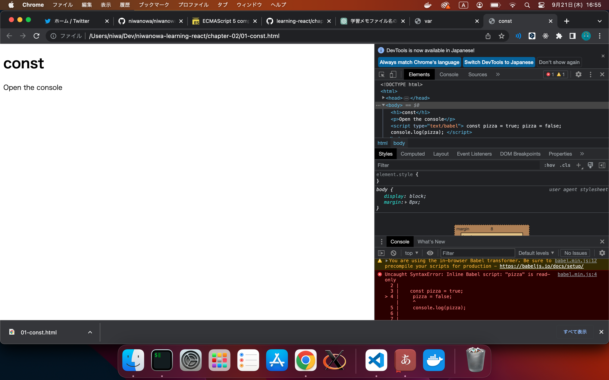
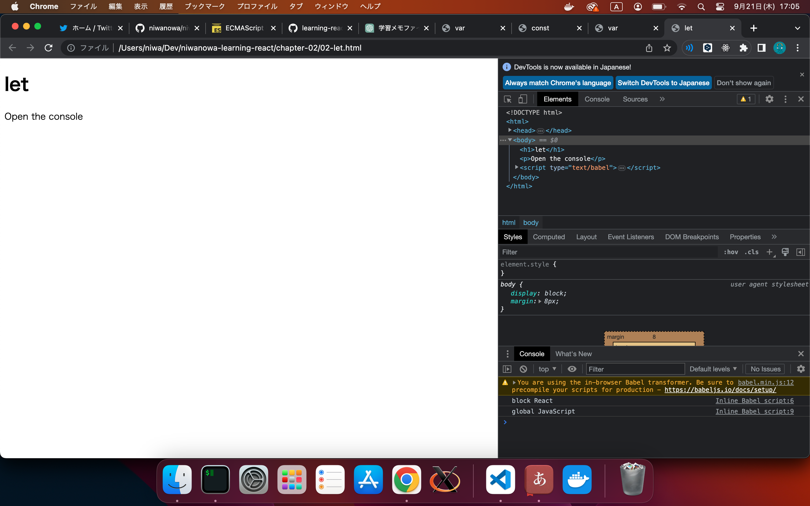
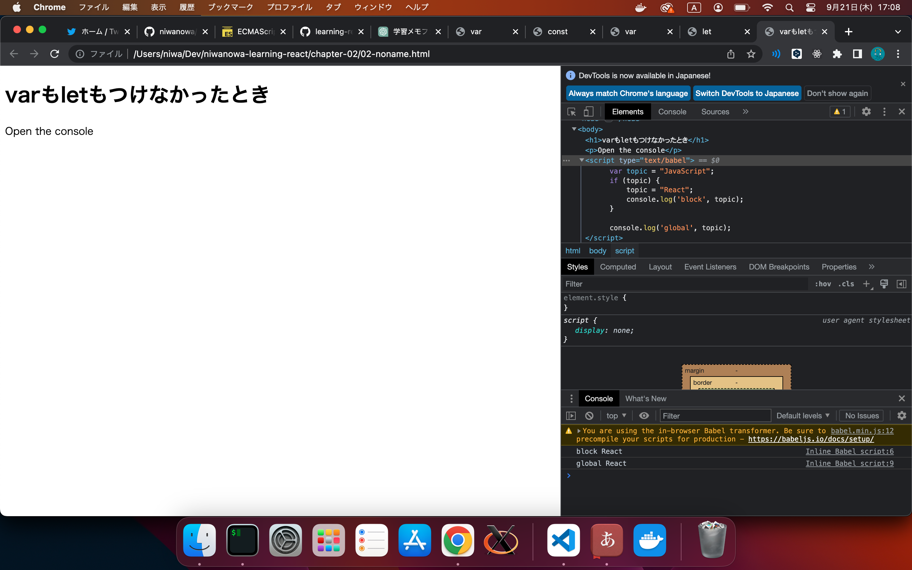
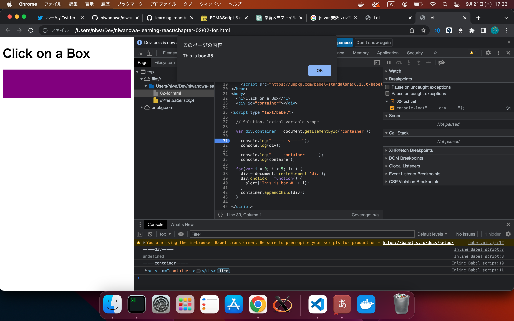
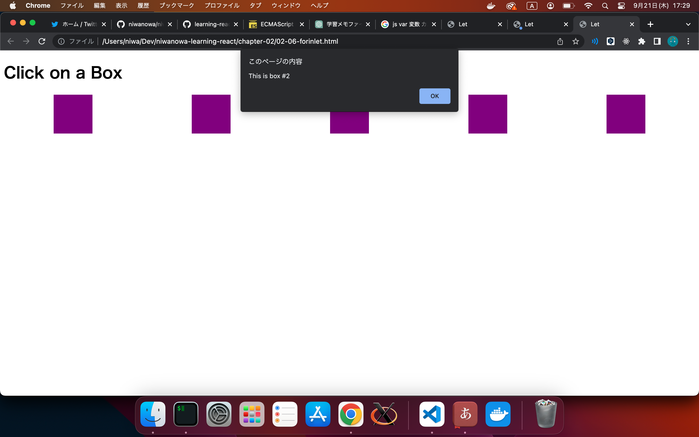
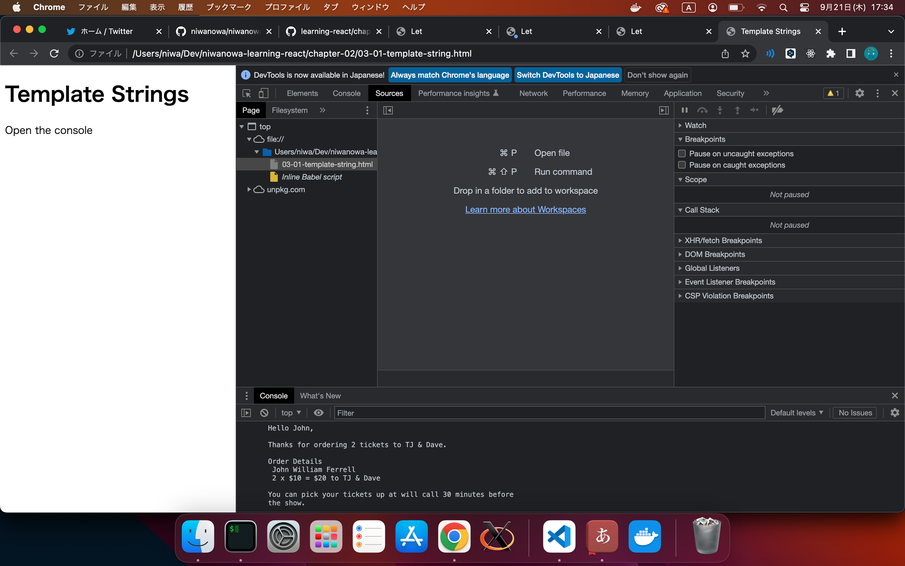
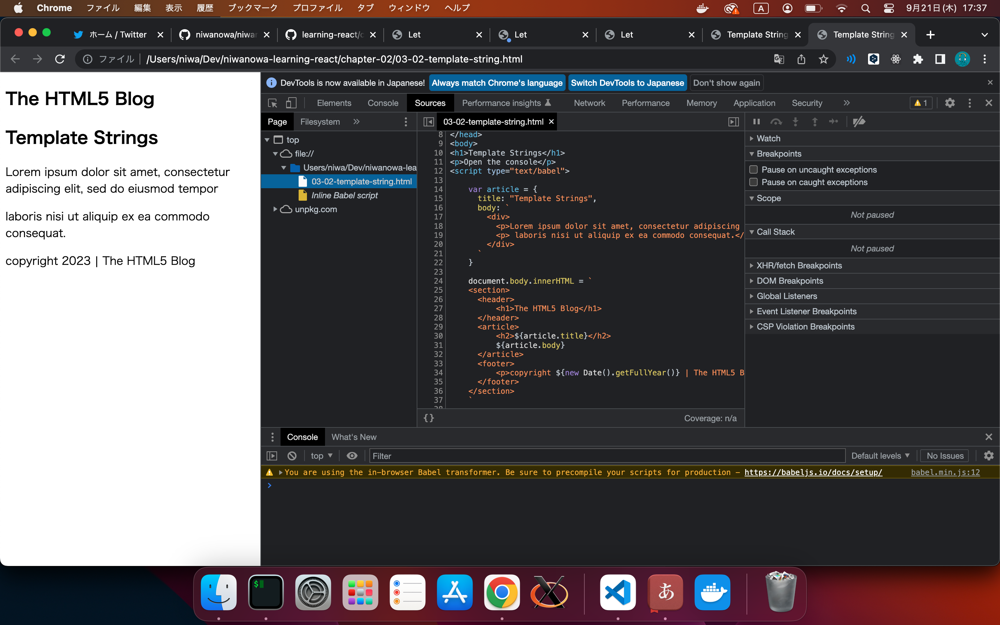

#  2章　React学習に必要なJavaScriptの知識
- DHTMLとは(chatGPTに聞いた)
```
DHTML（Dynamic HyperText Markup Language）は、静的なHTML（HyperText Markup Language）を動的に変更することができる技術の総称です。これにはHTML、CSS（Cascading Style Sheets）、およびJavaScriptが組み合わさって使われます。

以下に、DHTMLの主な要素を簡単に説明します：

1. **HTML（HyperText Markup Language）**:
   - HTMLはウェブページの基本的な構造を定義します。テキスト、リンク、画像などの要素を配置するために使用されます。

2. **CSS（Cascading Style Sheets）**:
   - CSSはウェブページのスタイルやレイアウトを制御します。色、フォント、配置などの外観を指定します。

3. **JavaScript**:
   - JavaScriptはプログラミング言語であり、ウェブページの動的な振る舞いを制御します。要素の表示/非表示、アニメーション、フォームの操作などが可能です。

4. **DOM（Document Object Model）**:
   - DOMはウェブページの要素や構造を表現するツリー構造です。JavaScriptを使ってDOMを操作することで、ページの要素を動的に変更できます。

5. **イベント処理**:
   - DHTMLでは、ユーザーの操作（クリック、マウスオーバーなど）に対する反応を定義できます。これにより、ユーザーとの対話が可能になります。

6. **アニメーション**:
   - JavaScriptとCSSを組み合わせて、要素のアニメーションを実装できます。例えば、フェードイン/フェードアウト、スライドなどのエフェクトがあります。

7. **Ajax（Asynchronous JavaScript and XML）**:
   - Ajaxは非同期通信を利用して、ウェブページの一部を更新する技術です。ページ全体を再読み込みせずにデータを取得したり送信したりできます。

DHTMLは1990年代後半から2000年代初頭にかけて特に人気で、動的なウェブページを作成するために広く使用されました。しかし、近年ではより先進的な技術やフレームワークが利用されるようになり、DHTMLはやや陰りを見せています。それでも、基本的なプログラミング概念を理解するためには依然として重要です。
```
あー、動的なうんたらね。。。

- ajaxとは
```
Ajax（Asynchronous JavaScript and XML）は、ウェブページを非同期的に更新するための技術です。この技術を使うことで、ページ全体を再読み込みせずに、データの取得や送信ができます。

以下にAjaxの主な要素を簡単に説明します：

1. **非同期通信**:
   - Ajaxは「非同期」にデータをやり取りします。つまり、ページの他の部分が再読み込みされることなく、特定の要素だけが更新されます。これにより、ユーザーエクスペリエンスが向上します。

2. **XMLHttpRequestオブジェクト**:
   - Ajaxは、`XMLHttpRequest`オブジェクトを使用してサーバーとの通信を行います。このオブジェクトを使ってデータの送受信を管理します。

3. **データの送受信**:
   - Ajaxを使うと、サーバーからデータを取得したり、サーバーにデータを送信したりできます。これにより、リアルタイムな情報の表示やフォームの送信などが可能になります。

4. **コールバック関数**:
   - Ajaxは通常、非同期の性質を利用して、データが取得された後に実行されるコールバック関数を使用します。これにより、データの処理や表示が行えます。

5. **JSONやXMLの利用**:
   - Ajaxは最初XMLを主に扱っていましたが、最近ではJSON（JavaScript Object Notation）がよく使われます。JSONやXMLはデータを構造化して表現するためのフォーマットです。

Ajaxは、動的なウェブページやシングルページアプリケーション（SPA）などを開発する際に重要な技術です。例えば、Googleマップのようなリアルタイムな地図アプリケーションやSNSのタイムラインのような動的なコンテンツの表示に活用されています。
```
あーasyncうんたらとかね...

- ECMAScript準拠表
 リンク : [ECMAScript 5 compatibility table](http://kangax.github.io/compat-table/es5/)

## 2.1.1 constキーワード
- varで定義したとき


- constで定義したとき

まぁ、それはそう。

## 2.1.2 letキーワード
- varで色々したとき
  
  たしかにglobalでは"JavaScript"であって欲しいかも

- letで定義したとき

想定していた挙動
- varもletもつけなかったら？

そうなるの？
- let、letの場合は？

それはそう
- forでのscopeの扱い

alertを呼ぶときはglobalなiを見ているからってイメージ。 
わからんくはない。
それよりも変数の定義の仕方が恐怖を感じた。
- for in let


納得の挙動

## 2.1.3 テンプレート文字列
納得の挙動(サンプルまま)


article.titleでcontent.head.titleでも撮ってくるのかと思ったら定義してたね。


#　2.2関数
## ２．２．２　関数式
関数式として宣言した場合は巻き上げが行われないらしい。
変数が巻き上げられるのはおかしいもんな。

## 2.2.4　アロー関数
アロー関数、どう使うのかなって思ってたけどバリデーションで使えそうだなーなどと

##　2.2.4.2 アロー関数とスコープ
頭爆発。後で読み直そう
 printは関数式として宣言してsetTimeoutの中はアロー関数にすることで。
 アロー関数はスコープを持たないからprint関数と同じスコープ(mountains)を見れる
 printはスコープを持つため同階層のものをアクセスできる。
 printをアロー関数にしちゃうとprintを呼び出している関数のスコープみちゃうから云々

 <!-- 2023/09/21 一旦ここまで -->

 ## 2.3 JavaScriptのコンパイル
体系的にJavaScriptを学んでなかったから知識が繋がる感じがする。
BabelはES.nextのブラウザ側実装を待たずに実現するために生まれた。
Babelを使う機会があれば[BaBel　REPL](https://babeljs.io/repl)を見てみると良さそう

## 2.4 オブジェクトと配列
## ２．４．１　デストラクチャリング
デストラクチャリングとは、オブジェクト変数に代入したり引数として受け取る際に、
必要なプロパティのみを取捨選択できる機能。
person.spouse.firstnameって書いてたところを{spouse: {firstname}}って記述できる。
スッキリ書けそうだけど脳内メモリ消費しそう...

## 2.4.4 スプレッド構文
スプレッド構文は、配列やオブジェクトの要素を展開する構文。
const peaks = ["Tallac", "Ralston", "Rose"];とした場合
...peaksとして参照する。
peaks.reverse()とするとpeaksの中身が変わる。(破壊的な変更が加えられてしまう)
ので¥[...peaks¥].reverse()とするとpeaksの中身は変わらない。