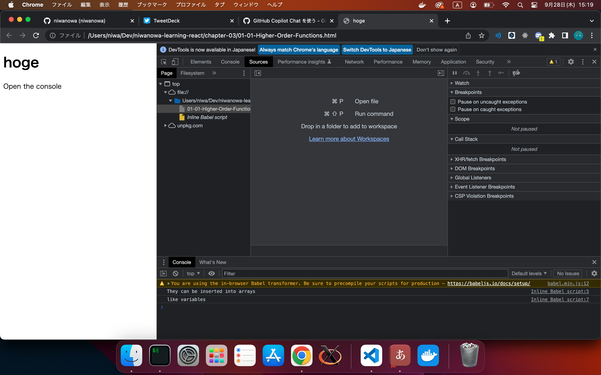

# 3章　JavaScriptにおける関数型プログラミング
## 3.1 関数型とは
- 関数型プログラミングは関数と変数を同等に扱うプログラミングスタイル
例：
```js
const messages = [
    "They can be inserted into arrays",
    message => console.log(message),
    "like variables",
    message => console.log(message),
];

massages[1](messages[0]);
massages[3](messages[2]);
```
気持ち悪いね。


関数の戻り値としても利用できるため、以下のような書き方もできる。
頭がバグるね。

- 関数型プログラミングは宣言型プログラミングに内包されている。

## 3.2 命令型 VS. 宣言型
- 命令型プログラミング
    よく見慣れている書き方
  例：
  ```js
    var string = "Restaurants in Hanalei";
    var urlFriendly = "";
    for (var i =0; i < string.length; i++) {
        if(string[i] === " ") {
            urlFriendly += "-";
        } else {
            urlFriendly += string[i];
        }
    }

    console.log(urlFriendly);
  ```

- 宣言型プログラミング
  新概念
  ```js
    const string = "Restaurants in Hanalei";
    const urlFriendly = string.replace(/ /g, "-");
    console.log(urlFriendly);
  ```

  ## 3.3  関数型プログラミングの基本概念
    -  イミュータブルなデータ
    -  純粋関数
    -  データの変換　<-- ???
    -  高階関数
    -  再帰

    ### 3.3.1 イミュータブルなデータ
    - イミュータブルなデータとは、変更不可能なデータのこと。
    - データを変更するときはデータのコピーをとり、そのコピーに対して変更を加える。
    - 破壊的な変更を加えるメソッドあるの何？

    ### 3.3.2 純粋関数
    - 純粋関数とは、引数の値のみを参照して、それをもとに計算し、値を返す関数のこと。
    - 少なくともひとつの引数を受け取らなければならない。
    - 関数は値もしくは他の関数を戻り値として返却しなければならない。
    - 関数は引数や関数外で定義された変数に直接変更を加えてはならない。

    ### 3.3.3 データの変換
    ...

    ### 3.3.4 高階関数
    - 他の関数を引数に取るか、戻り値として関数を返すか、もしくは両方を満たす関数のこと。

    ### 3.3.5 再帰
    - 関数が自分自身を呼び出すこと。

    ### 3.3.7 アプリケーションの構築
    - ToDo：サンプルコードを写経する。